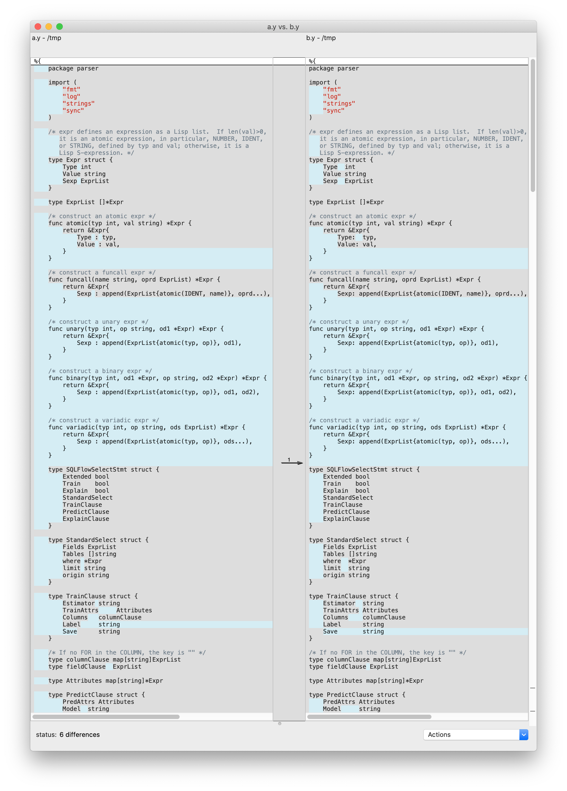

# `goyaccfmt`

[](https://travis-ci.org/wangkuiyi/goyaccfmt)
[](https://goreportcard.com/badge/github.com/wangkuiyi/goyaccfmt)

`goyaccfmt` auto reformats [`goyacc`](https://godoc.org/golang.org/x/tools/cmd/goyacc) source code by calling [`gofmt`](https://golang.org/cmd/gofmt/). 

<table border=0>
<tr><td>

The following command reformats a source file `a.y` and outputs to stdout.

```bash
goyaccfmt a.y
```

For inline reformat, please use option `-w`.

```bash
goyaccfmt -w a.y
```

To the right is the difference before and after auto reformatting the grammar rule file of [SQLFlow](https://sqlflow.org/sqlflow).

</td><td>



</td></tr>
</table>

## Usage

- To beautify one or more files and write to stdout:

   ```bash
   goyaccfmt a.yaml b.yaml c.yaml
   ```

- To beautify one or more files in the replace mode:

  ```bash
  goyaccfmt -w a.yaml b.yaml c.yaml
  ```

- To beautify stdin and write to stdout:

  ```bash
  cat a.yaml | goyaccfmt
  ```

- To beautify stdin and write to a file:

  ```bash
  cat a.yaml | goyaccfmt > b.yaml
  ```
